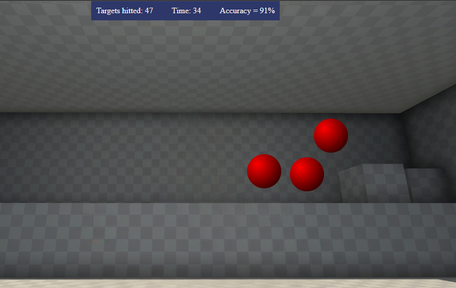

# Aim Lab Cloned

Steam Aim Lab cloned and adapted on a website. 
Aim lab is originally an aplication used by many online FPS (First Person Shooter) players, wich allow us to improve our
reaction, aim and some other important components for FPS games.

## 💻 Used technologies:
<code></code>
<code></code>
<code></code>

## 🏹 Project:

>Aim lab picture

# 🎯 How does it works?

- After opening the website project, click "START"
- Three red targets will appear on your screen (They're responsively sized based on your screen)
- Shoot as many targets as possible

After 60sec, you'll get a report of your hits, misses and accuracy.
Try again to see if you can be better next time...

# This project still being developed...

🎉To see my project on live, please access:

https://amerele.github.io/aim-lab/

